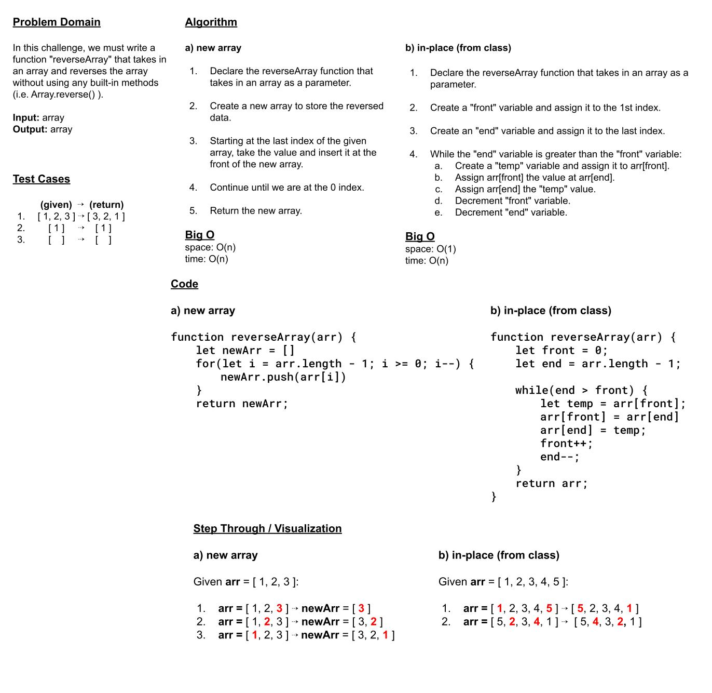

# Reverse an Array

In this challenge, we must write a function `reverseArray` that takes in an array and reverses the array without using any built-in methods (i.e. `Array.reverse()`).

## Whiteboard Process

## Approach & Efficiency
For my own solution, I chose to define a new array and use a for loop to iterate from the end of the given array `arr` and add to the new array `newArr`.

Big O:
space: O(n)
time: O(n)

However, in class we discussed a better more space-efficient solution that reverses the array in-place instead of making a new array.

Big O:
space: O(1)
time: O(n)
