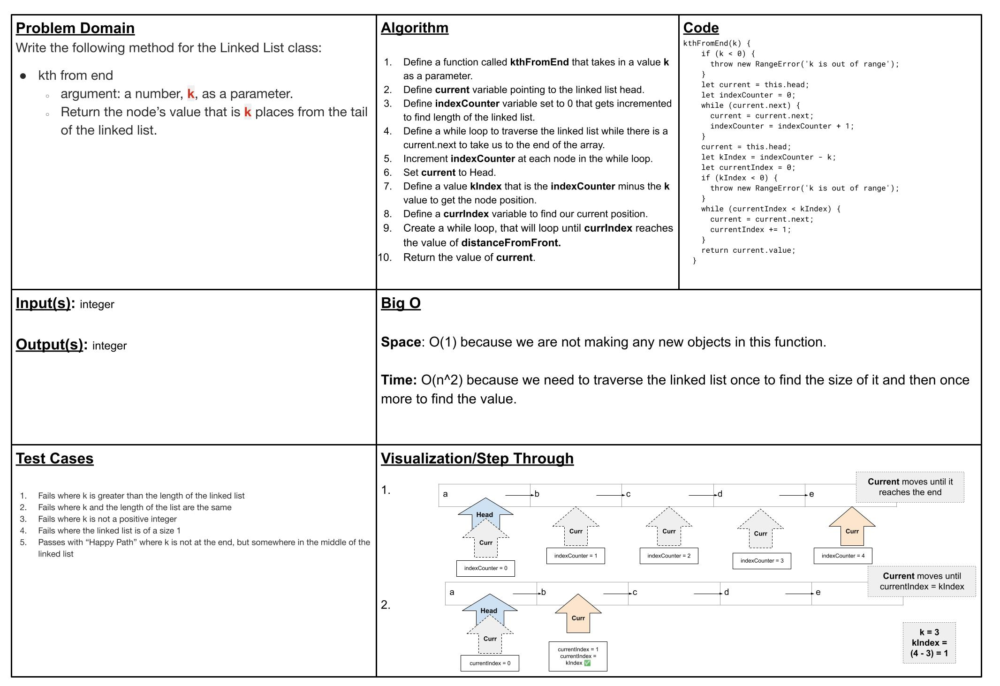
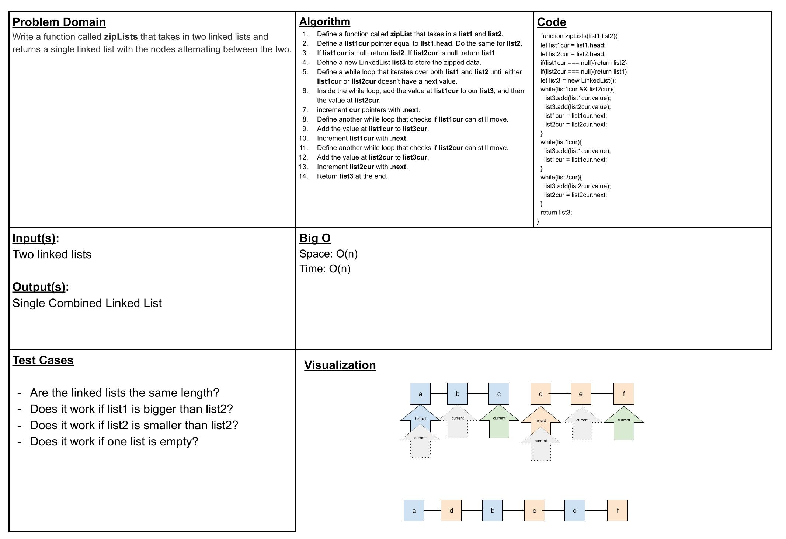
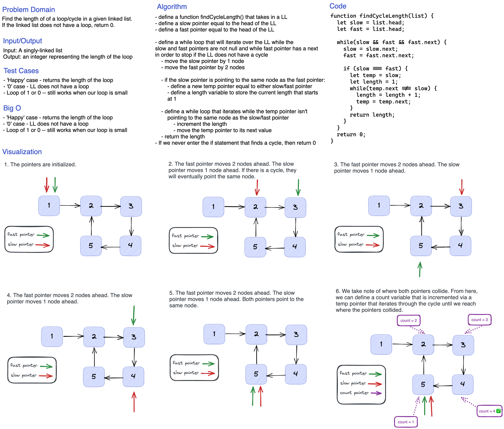

# Singly Linked List

In this lab, we implement our own LinkedList and Node class from scratch.

## Challenge

The purpose of this challenge is to practice implementing the linked list data structure and also to practice writing tests for our code.

In CLASS-37, we were given the option to select any problem of our choice. For this code challenge, I chose to solve the problem `findCycleLength` where we are tasked with finding the length of a loop/cycle in a given linked list. If the linked list does not have a loop, it returns 0.

## API

The LinkedList class contains the following functions:

- `insert()` -- to add a new Node to the front of the LinkedList
- `includes()` -- to find whether a given value is in the LinkedList
- `toString()` -- a string representation of the LinkedList
- `append()` -- to add a new Node to the end of the LinkedList
- `insertBefore(targetValue, value)` -- to add a new Node before the first instance of the targetValue
- `insertAfter(targetValue, value)` -- to add a new Node after the first instance of the targetValue
- `kthFromEnd(k)` -- to find a value that is  **k** elements away from the end
- `zipLists(a, b)`-- takes 2 linked lists and "zips" their values

## Approach & Efficiency

Here are the Big O time complexities for the above functions:

- `insert()` -- O(1)
- `includes()` -- O(n)
- `toString()` -- O(n)
- `append()` -- O(n)
- `insertBefore(targetValue, value)` -- O(n)
- `insertAfter(targetValue, value)` -- O(n)
- `kthFromEnd(k)` -- O(n^2)
- `zipLists(a, b)` -- O(n);

## Whiteboards

### CLASS-07: kth-from-end

### CLASS-08: zip-lists

### CLASS-37: findCycleLength()

