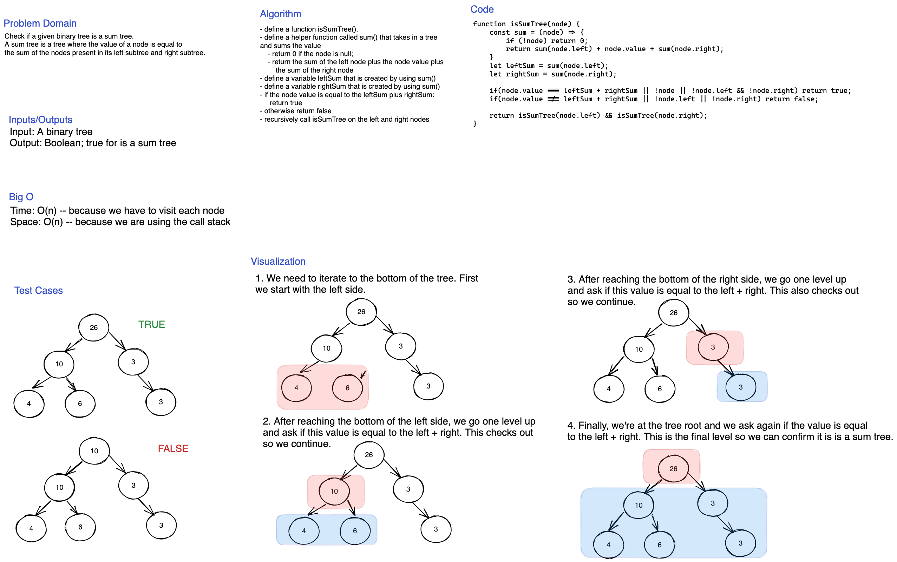

# Trees

In this lab, we implement our own Binary Tree and Binary Search Tree structures.

## Challenge

In CLASS-15, we implement the Binary Tree and Binary Search Tree classes along with a Node class. We also include basic methods.

In CLASS-16, we add a function to the Binary Tree to find the maximum value within a tree.

In CLASS-36, we are given the option to select our own problem for practice. For this challenge, I chose to do a problem to check whether a binary tree is a sum tree. A sum tree is defined as a tree where the value of a node is equal to the sum of the nodes present in its left and right subtrees.

## Approach & Efficiency

### Binary Tree

- traversals - O(n) -- We have to go through each node n.
- `maxValue()` - O(n) -- Same as above.

### Binary Search Tree

- `add` - O(h) -- we may have to search from the root to the leaves which is equal to the height (h) of the tree.
- `contains` - O(h)

### Is Sum Tree

- Time: O(n) we have to traverse all the nodes in the tree
- Space: O(n) we have to use the call stack

## API

### Binary Tree

- preOrderTraversal
- inOrderTraversal
- postOrderTraversal
- breadthFirst
- maxValue

### Binary Search Tree

Extends Binary Tree with these added functions.

- `add` -- adds a new node in the correct location in the BST
- `contains`

## Whiteboards

### CLASS-16: Tree Max Value

### CLASS-17: Breadth First Traversal

## CLASS 36: Is Sum Tree

